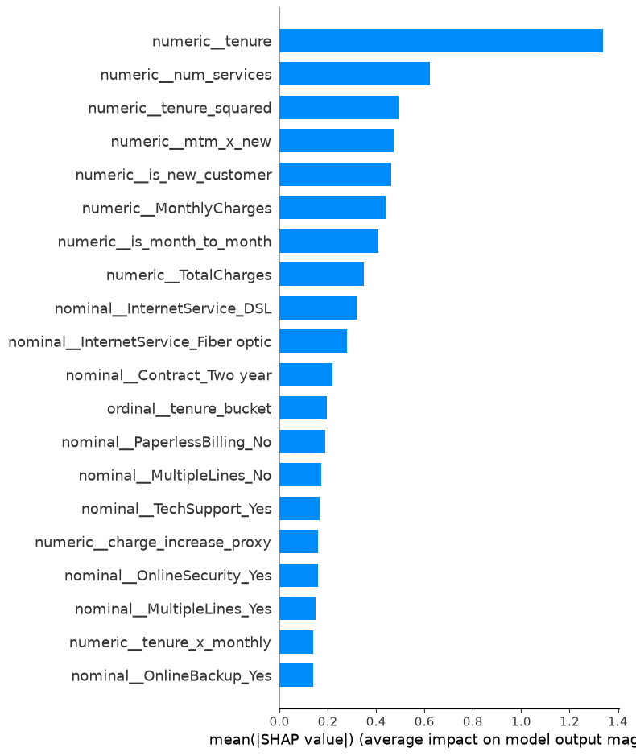

# Customer Churn Prediction

A production-grade machine learning pipeline for predicting customer churn on the IBM Telco dataset. The project covers the full ML lifecycle: feature engineering, class-imbalance handling (SMOTE, class weights, threshold tuning, cost-sensitive learning), hyperparameter optimisation with Optuna, SHAP-based explainability, and an interactive Streamlit dashboard.

---

## Dataset

| Statistic | Value |
|-----------|-------|
| Rows | 7,043 |
| Columns | 21 |
| Churn rate | 26.5% |
| Train / Val / Test split | 4,929 / 1,057 / 1,057 |
| Engineered features selected | 25 |

Source: IBM Telco Customer Churn dataset (`data/raw/telco_churn.csv`).

---

## Model Comparison (Test Set)

| Model | AUC-ROC | AUC-PR | F1 | Precision | Recall | Accuracy | Log Loss | Brier Score |
|---|---|---|---|---|---|---|---|---|
| LogisticRegression | 0.8537 | **0.6756** | 0.5896 | 0.6667 | 0.5286 | 0.8051 | 0.4043 | 0.1324 |
| RandomForest | 0.8515 | 0.6694 | 0.6331 | 0.5301 | 0.7857 | 0.7588 | 0.4651 | 0.1560 |
| XGBoost | 0.8407 | 0.6507 | 0.6154 | 0.5118 | 0.7714 | 0.7446 | 0.4797 | 0.1625 |
| LightGBM | 0.8462 | 0.6616 | 0.6329 | 0.5220 | **0.8036** | 0.7531 | 0.4806 | 0.1625 |

> Primary tuning target: **AUC-PR** (better suited for imbalanced classes than AUC-ROC).

---

## SHAP Feature Importance



---

## Business Insights

- **Contract type dominates**: Month-to-month contract customers account for ~65% of total model feature importance. Converting customers to annual or two-year contracts is the single highest-ROI retention action.
- **Early-tenure risk**: The interaction term `mtm_x_new` (month-to-month x new customer) ranks 3rd in importance — customers in their first 90 days on flexible contracts need proactive outreach before churn intent solidifies.
- **Fiber optic + no add-ons**: Customers on Fiber optic internet without OnlineSecurity or TechSupport churn significantly more, making security/support upsell a dual revenue and retention opportunity.

---

## Install & Run

```bash
python -m venv .venv && source .venv/bin/activate
pip install -r requirements.txt
python data/download.py
python -m models.trainer
python -m models.evaluator
streamlit run dashboard/app.py
```

---

## Project Structure

```
customer_churn_prediction/
├── data/               # Raw data download script
├── features/           # Feature engineering, preprocessing, selection
├── imbalance/          # SMOTE, class-weight, threshold, cost-sensitive strategies
├── models/             # Trainer, evaluator, baseline, tree model wrappers
├── explainability/     # SHAP analysis
├── visualisation/      # Plot utilities
├── dashboard/          # Streamlit app (loads persisted models)
├── pipeline/           # End-to-end smoke-test pipeline
└── results/
    ├── models/         # Persisted .pkl model files
    ├── summary.txt     # Full metrics summary with SHAP drivers
    └── *.png           # ROC, PR, confusion matrix, calibration, SHAP plots
```
